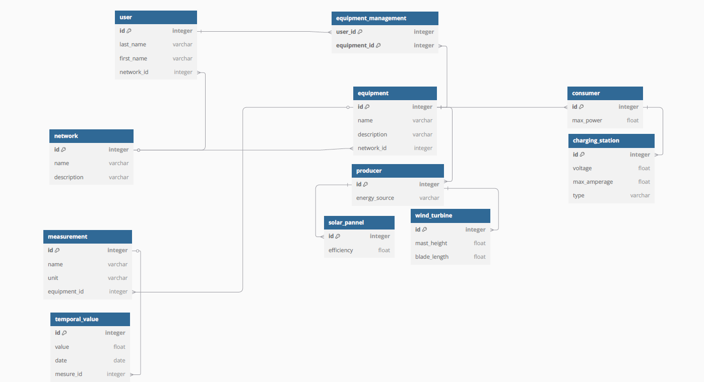
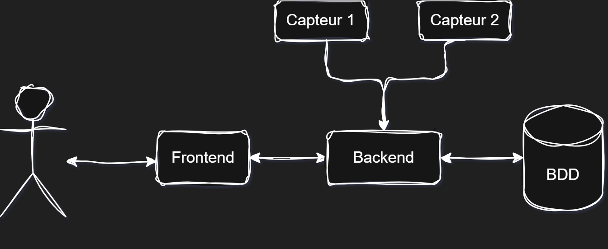

# SAÉ Smart Grid - IMT Atlantique

## Présentation

Projet académique réalisé au semestre 6 à IMT Atlantique. Cette SAÉ (Situation d'Apprentissage et d'Évaluation) intègre les enseignements de programmation objet, réseaux et bases de données autour d'un logiciel de gestion de réseaux intelligents d'énergie.

## Contexte

Système de gestion de réseaux électriques intelligents à l'échelle urbaine. L'application permet la supervision complète d'un réseau énergétique, incluant la gestion des utilisateurs, des équipements et des données temporelles de mesures.

## Fonctionnalités principales

### Gestion des réseaux
- Création et modification de réseaux énergétiques
- Gestion des utilisateurs et équipements par réseau

### Gestion des utilisateurs
- Création, modification et suppression d'utilisateurs
- Gestion des droits d'accès aux équipements

### Gestion des équipements
**Types d'équipements :**
- **Producteurs** : Panneaux solaires et éoliennes
- **Consommateurs** : Bornes de recharge électrique

### Données temporelles
- Mesures par équipement avec valeurs et timestamps
- Suivi de la production/consommation énergétique\
\

## Architecture

**Système multi-couches :**
- Interface utilisateur
- Serveur d'application
- Gestion des données
- Simulation de capteurs\
\

## Technologies

- **Développement** : Java, Vert.x
- **Communication** : TCP/UDP
- **Gestion de build** : Maven/Gradle
## Mise en place

- Placez vous dans ce répertoire et exécutez la commande `docker compose up -d` pour lancer le serveur postgresql
- Lancez le projet avec `./gradlew.bat run` (utilisez `gradlew` sur macOS / linux)

Le backend est accessible sur le port `8080`, le frontend est accessible [ici](http://localhost:8082).
Une interface web pour administrer la base de données est accessible [ici](http://localhost:80801), sélectionnez `PostgreSQL` comme système, `db` comme serveur et `test` comme utilisateur/mot de passe/base de données. 